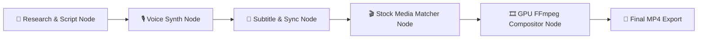

<div align="center">

# 🎬 Vivara

### **The Free, Open-Source, Local AI Creator Studio**
*Transform raw ideas, scripts, and long-form podcasts into production-ready videos using modular DAG pipelines.*

[](LICENSE)
[](https://python.org)
[](https://react.dev)
[](https://fastapi.tiangolo.com)
[](https://tailwindcss.com)
[](https://ffmpeg.org)

</div>

---

## ⚡ Why Vivara?

Unlike simple one-click generators that produce rigid, cookie-cutter output, **Vivara** is built as an **AI Creator Studio & Workflow Platform**. It splits video creation into an independent, non-destructive **DAG Node Graph Pipeline**:



Every node can be **executed, re-run, edited, or skipped** independently. Tweak your script without re-generating audio, or change voice presets without re-fetching stock footage!

---

## ✨ Features at a Glance

### 🚀 1. Workflow Platforms
Select pre-configured creator workflows tailored with specialized prompts:
* 🏆 **Top 10 Rankings & Countdowns** (Listicles, Top 5, Versus comparisons)
* ⭐ **Movie & Game Reviews** (Pros/cons breakdown, score rating)
* 💡 **Explainer & Lore Videos** (Deep dives, problem breakdown, key takeaways)
* 📱 **YouTube Shorts & Reels** (Vertical 9:16, punchy 3s hook, under 60s)
* 🎬 **Cinematic Documentaries** (Historical arcs, mystery, storytelling)
* 📚 **Educational Courses** (Step-by-step guides, summaries)
* 🎮 **Tech & Gaming News** (Daily headlines, fast summaries)
* 🎙️ **Podcast Clips & Highlights** (Speaker zoom, audio spike detection)

---

### 🎙️ 2. Universal Voice Engine (5 Supported TTS Providers)
| Engine | Type | Cost / Quota |
|---|---|---|
| **Kokoro-82M** *(Default)* | Offline / Local Neural TTS | **100% Free & Unlimited** |
| **Edge-TTS** | Online Microsoft Neural Voices | **100% Free & Unlimited** |
| **Google Translate TTS (gTTS)** | Online Google Voice Engine | **100% Free (100+ Languages, No Key)** |
| **ElevenLabs** | Cloud Hyper-Realistic API | **10,000 Free Chars/Month** |
| **OpenAI Speech API** | OpenAI Audio (`alloy`, `nova`, etc.) | **High Quality Audio** |

---

### 📸 3. Open & Stock Media Engines
| Provider | Media Type | API Key Requirement |
|---|---|---|
| **Openverse / Wikimedia** *(Default)* | Photos & Open Media | **100% FREE — ZERO Key Required!** |
| **Pexels** | Stock Videos & Photos | Free API Key (200 req/hr) |
| **Pixabay** | Stock Videos & Photos | Free API Key (5,000 req/hr) |
| **Unsplash** | High-Res Stock Photography | Free API Key (50 req/hr) |

---

### ✂️ 4. Clip Intelligence Studio (Podcast Repurposing)
Import any long-form video or YouTube link to automatically:
1. **Silence Removal**: Trims awkward pauses automatically.
2. **Audio Spike Detection**: Identifies laughter, applause, or high-energy moments.
3. **Face & Speaker Zoom**: Tracks active speakers into 9:16 vertical frame.
4. **Auto-Captions**: Burns stylized captions (Hormozi style, Minimalist, Cinematic).

---

### 🛠️ 5. Complete Project Management
* ✏️ **Rename & Edit**: Change project titles or edit scripts inline anytime.
* 📋 **1-Click Duplicate**: Clone existing project configs with one click.
* 🗑️ **Delete & Cleanup**: Permanently remove project data & rendered files.
* 📥 **Direct MP4 Download**: One-click download straight from your browser.

---

## 🛠️ Quick Start (Windows)

### 1. Prerequisites
- **Python 3.10+** — [Download Python](https://python.org/downloads)
- **Node.js 18+** — [Download Node.js](https://nodejs.org)
- **FFmpeg** — Install via `winget install ffmpeg` or [Download FFmpeg](https://ffmpeg.org)
- **OmniRoute / Ollama** *(Recommended for local LLM)* — [Download OmniRoute](https://github.com/diegosouzapw/OmniRoute) or [Download Ollama](https://ollama.com)

### 2. Installation & Launch
```powershell
# Clone the repository
git clone https://github.com/vivekmarathe2004/Vivara.git
cd Vivara

# Run the 1-click batch launcher
.\start.bat
```

The app will open automatically at **`http://localhost:5173`**.

---

## 📁 Architecture Overview

```
Vivara/
├── backend/                  # Python FastAPI Backend
│   ├── api/                  # Projects, Generate, Settings, Setup, Clip endpoints
│   ├── services/
│   │   ├── llm/              # OmniRoute, Ollama, OpenAI-compat providers
│   │   ├── tts/              # Kokoro, Edge-TTS, gTTS, ElevenLabs, OpenAI Speech
│   │   ├── media/            # Openverse, Pexels, Pixabay, Unsplash
│   │   ├── subtitle/         # faster-whisper transcription & styling
│   │   ├── render/           # FFmpeg compositing & GPU acceleration
│   │   └── clip_mode/        # Clip intelligence & silence removal
│   └── main.py               # FastAPI entry point
├── frontend/                 # React 18 + Vite + TypeScript + Tailwind CSS
│   └── src/
│       ├── pages/            # Dashboard, NewProject, ProjectDetail, ClipMode, Settings
│       ├── components/ui/    # Cards, Modals, Buttons, Badges, Inputs
│       ├── store/            # Zustand state management
│       └── api/              # Backend HTTP & SSE wrappers
└── start.bat                 # Windows automated startup script
```

---

## 🤝 Contributing

Contributions are warmly welcome! Whether it's adding new workflow prompt templates, expanding media providers, or improving UI components:

1. Fork the Project
2. Create your Feature Branch (`git checkout -b feature/AmazingFeature`)
3. Commit your Changes (`git commit -m 'Add some AmazingFeature'`)
4. Push to the Branch (`git push origin feature/AmazingFeature`)
5. Open a Pull Request

---

## 📄 License

Distributed under the **MIT License**. See `LICENSE` for more information.

<div align="center">
  <sub>Built with ❤️ by Creators for Creators.</sub>
</div>
